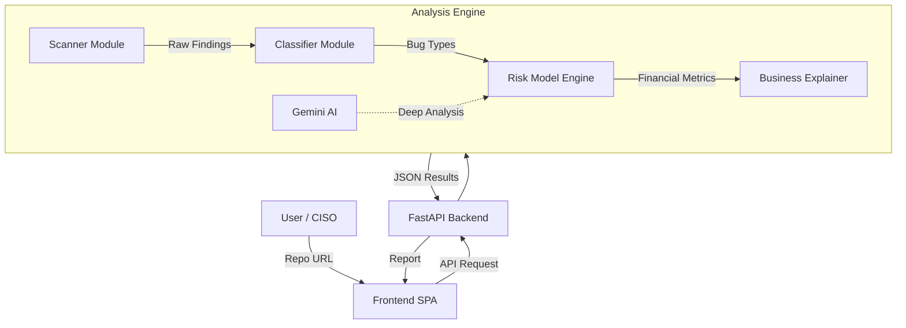

# Architecture Overview

FinRisk is a modular security analysis platform designed to translate technical findings into financial risk metrics. This document describes the core components and data flow of the system.

## 🏗 High-Level Architecture

The system follows a modular architecture consisting of a **FastAPI Backend**, an **Analysis Engine**, and a **Single Page Application (SPA) Frontend**.

## 🧩 Core Components

### 1. FastAPI Backend (`main.py`)
The gateway for all user interactions. It manages:
- **API Endpoints**: `/scan-repo`, `/analyze-manual`, `/health`.
- **Orchestration**: Coordinating calls between the scanner, risk model, and AI modules.
- **State Management**: Handling temporary file paths and environment configurations.

### 2. Scanner Module (`engine/scanner.py`)
Responsible for acquiring and analyzing source code.
- **Git Integration**: Clones remote repositories into temporary directories.
- **Semgrep Integration**: Executes Semgrep with pre-configured security rulesets (`p/security-audit`, `p/owasp-top-ten`).
- **Parsing**: Normalizes raw Semgrep JSON output into a consistent internal format.

### 3. Classifier Module (`engine/classifier.py`)
Bridges the gap between raw scanner rules and business-impact bug types.
- **Rule Mapping**: Uses a keyword-based taxonomy to map hundreds of Semgrep rules to high-level categories (e.g., SQL_INJECTION, AUTH_BYPASS).
- **Effort Estimation**: Assigns typical "fix effort hours" to each bug type based on industry benchmarks.

### 4. Risk Model Engine (`engine/impact_model.py`, `engine/expected_loss.py`)
The "math core" of the system. It calculates:
- **P(Exploit)**: Probability based on exposure (Public/Internal) and bug type.
- **Financial Impact**: Recursive calculation of breach costs, downtime, and regulatory fines.
- **Expected Loss (EL)**: The actuarial value of the risk (`EL = P * I`).

### 5. Gemini AI Module (`engine/gemini_analyzer.py`)
Enhances findings with LLM-powered context analysis.
- **Context Awareness**: Analyzes surrounding code to confirm exploitability.
- **Triage**: Filters out false positives (e.g., test code, mock data).
- **Remediation**: Generates tailored code fixes for each vulnerability.

### 6. Knowledge Base (`knowledge_base/`)
A collection of data-driven JSON files that define the system's "intelligence":
- `bug_taxonomy.json`: Definitions of bug categories and fix efforts.
- `breach_costs.json`: Industry-specific benchmarks for data breach costs.
- `regulatory_models.json`: Logic for calculating global fines (GDPR, HIPAA).

## 📊 Data Flow

1.  **Ingestion**: User provides a GitHub URL and Company Context.
2.  **Collection**: Repository is cloned; Semgrep scans the codebase.
3.  **Classification**: Findings are mapped to business-critical bug types.
4.  **AI Enrichment** (Optional): Gemini analyzes high-risk findings for exploitability and business context.
5.  **Quantification**: Risk model calculates Expected loss based on company revenue, industry, and users.
6.  **Reporting**: Final results are ranked by ROI and presented via the dashboard.
